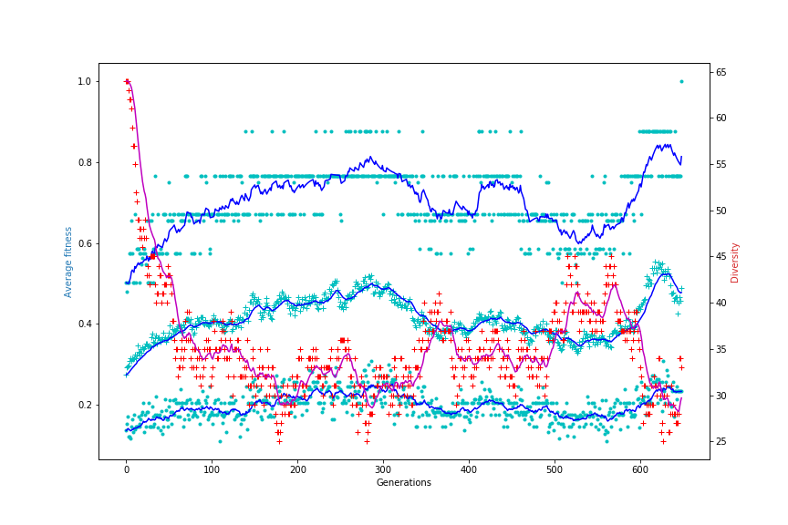

# N-Queens Evolutionary Algorithm Solution


## Setup & Running

I used a docker container with python3 and Jupyter installed:

```
docker run -p8888:8888 jupyter/datascience-notebook
```

After this is running, should be able to go to localhost:8888 in a browser (check the console for the token to log in)

Import the `queens_ea.ipynb` file and run the cells.

## Results

Every run will create a folder under `results/DATE_TIME` which will contain:
* Copy of what the notebook looked like when run
* CSV with the raw data points
* Plot of the data
* A text file with the solution if one was found

An example of the plots that will be output:
 

* **blue +** - average generation fitness
* **blue line** - EMA of average generation fitness
* **blue dots** - max and min generation fitness
* **blue line** - EMA of max and min generation fitness
* **red +** - population diversity measure
* **red line** - EMA of population diversity measure

Clearly this plot should have a key but it does not :(

NOTE: the results only exist inside the docker container so shutting down will wipe out everything